# The Local AI Architect — Design Document & Storyboard
**"To teach the game, you must play the game."**

> [!IMPORTANT]
> This is the **single source of truth** for the project. It must be updated after every session. All code, art, and content decisions trace back to this document.

---

## 1. Product Definition

### What Is This?
A **20-minute E-learning module** disguised as a 2D RPG. Teachers play as "Architects" who learn to build gamified curricula using local, privacy-respecting AI tools. The entire experience runs on the learner's own machine—no cloud, no accounts, no data leaving the device.

### The Core Thesis
> Teachers are becoming **consumers** of AI, not **creators**. This module turns that around by teaching them to wield AI as a creative tool, not just a content generator.

### Target Audience
| Attribute | Detail |
|-----------|--------|
| **Who** | K-12 and Higher Ed teachers (any subject) |
| **Tech Level** | Comfortable with basic computer use; no coding required |
| **Time Budget** | Exactly **20 minutes** of focused gameplay |
| **Outcome** | A teacher who understands how to use local AI to design interactive learning experiences |

### Design Constraints
- ⏱️ **20-minute hard limit** — the module must be completable in one sitting
- 🔇 **Hands-free capable** — playable with keyboard only; video "Help" and "Ask Me" buttons replace live instruction
- 🔒 **Air-gapped** — all AI inference is local (Ollama/Candle); zero external API calls
- 🎮 **Game-first** — if it feels like a slideshow, it has failed

---

## 2. The Two Worlds

The platform has two complementary environments. **This design document focuses on World 2** (the Sovereign Sandbox), which is the playable RPG module.

### World 1: The Quest Log (Web App) — COMPLETE
- **Stack**: HTML5 / Vanilla CSS / JavaScript
- **Location**: `forge-web/`
- **Role**: LMS hub, terminal sandbox, prompt engineering playground
- **Modules**: The Forge → The Logic Engine → The Web Runtime

### World 2: The Sovereign Sandbox (Rust/Bevy RPG) — THIS MODULE
- **Stack**: Rust, Bevy ECS, Candle (Phi-3), Rhai scripting
- **Location**: `sovereign-sandbox/`
- **Role**: The 20-minute RPG experience where teachers learn by playing

---

## 3. Aesthetic: "Daydream Matrix-Rust"

| Token | Hex | Role |
|-------|-----|------|
| Phosphor Amber | `#FFBF00` | Primary text, active states, energy, rewards |
| Phosphor Dim | `#B38600` | Borders, secondary text |
| Industrial Rust | `#B7410E` | Alerts, warnings, air-gap indicators |
| Deep Charcoal | `#1A1A1A` | Backgrounds, panels |
| Terminal Black | `#0D0D0D` | Console backgrounds |
| Status Green | `#40FF00` | Success, verified, safe |
| Cyan | `#00FFFF` | Teacher NPC, important highlights |

**Motifs**: Terminal boot screens, scanline overlays, retro-futuristic UI, pixel art sprites.
**Typography**: Monospace headers (VT323/JetBrains Mono), clean sans-serif body (Inter).
**Principle**: High information density. Workbenches, not marketing pages.

---

## 4. Pedagogical Framework

### Gagné's 9 Events of Instruction
Every quest module maps 1:1 to Gagné's framework. This is non-negotiable.

| # | Gagné Event | RPG Equivalent | In-Game Action |
|---|-------------|---------------|----------------|
| 1 | Gain Attention | Quest Hook | Cinematic text + Teacher speaks |
| 2 | Inform Objectives | Mission Briefing | Quest Log updates with goal |
| 3 | Stimulate Recall | Lore Check | Teacher references prior knowledge |
| 4 | Present Content | Loot Drop | 🧭 **Ollama Compass** unlocks (Step 4) |
| 5 | Provide Guidance | Mentor Hint | Teacher gives scaffolded guidance |
| 6 | Elicit Performance | Player Action | Learner performs a task |
| 7 | Provide Feedback | Status Check | 🔍 **Logic Lens** unlocks (Step 7) |
| 8 | Assess Performance | Boss Encounter | Learner answers a reflection question |
| 9 | Enhance Retention | Reward & Transfer | 🪞 **Feedback Mirror** unlocks (Step 9) |

### The LitRPG Isomorphism
| RPG Element | Educational Equivalent |
|-------------|------------------------|
| Quest | Learning Module |
| XP | Progress through Gagné's 9 Events |
| Level Up | Tool Acquisition |
| Loot | Knowledge & Skills |
| Boss Fight | Final Assessment |
| NPC Mentor | AI Teacher (Phi-3) |
| Inventory | Pedagogical Tools |
| Save File | Trinity Memory (sled + hnsw_rs) |

### Constructionism 2.0
- Learning results in a **public artifact** (a game, a simulation)
- The AI is a **"More Knowledgeable Other"** (Vygotsky) bridging intent and execution
- Errors are "glitches in the simulation," not failures

---

## 5. The 20-Minute Storyboard

### Pacing Budget

| Phase | Time | Gagné Events | Key Moment |
|-------|------|-------------|------------|
| **Act 1: Arrival** | 0:00–5:00 | 1–3 | Walk to Teacher, learn the world |
| **Act 2: Discovery** | 5:00–12:00 | 4–6 | Unlock Compass, perform first task |
| **Act 3: Mastery** | 12:00–18:00 | 7–9 | Unlock Lens & Mirror, reflect |
| **Epilogue** | 18:00–20:00 | — | Victory screen, next steps |

---

### Act 1: Arrival (0:00 – 5:00)

```mermaid
flowchart TD
    A["🖥️ Boot Sequence<br/>Title + Loading"] --> B["🗺️ Spawn in World<br/>Tutorial: 'Walk to the Teacher'"]
    B --> C{"Player walks<br/>to Teacher?"}
    C -->|In range| D["💬 Teacher: Gain Attention<br/>'We all want our students<br/>to be active participants...'"]
    D --> E["📋 Quest Log updates<br/>Gagné Event 2: Objectives"]
    E --> F["🧠 Teacher: Stimulate Recall<br/>'Once installed, we give it<br/>one instruction...'"]
    F --> G["✅ Act 1 Complete<br/>Player understands the world"]
    C -->|Not yet| B
```



**Module 1 Content** (from `module_1.toml`):
- **Quest**: "Starting Your Private Assistant (The Setup)"
- **Hook**: "We all want our students to be active participants..."
- **Objective**: Install and run Ollama locally, understanding privacy and sovereignty

**Player Experience**:
1. Game boots → pixel art world appears
2. Tutorial prompt: "→ Walk to the Teacher to begin"
3. Player uses WASD to reach the Teacher NPC
4. Tutorial despawns → "Press T to talk" appears
5. Teacher delivers Gagné Events 1–3 via AI dialogue
6. Quest Log fills in on the left panel

**Video Opportunity** 🎬: "Help" button could link to a **2-minute video** showing Ollama installation on a real computer.

---

### Act 2: Discovery (5:00 – 12:00)

```mermaid
flowchart TD
    A["📖 Gagné Event 4:<br/>Present Content<br/>'Even with internet off,<br/>your assistant is ready...'"] --> B["🎁 TOOL UNLOCKED!<br/>🧭 Ollama Compass<br/>Golden reward glow"]
    B --> C["🧭 Player activates Compass<br/>Press C → Cyan glow<br/>reveals memory links"]
    C --> D["📖 Gagné Event 5:<br/>Provide Guidance<br/>'Follow the installation guide...'"]
    D --> E["📖 Gagné Event 6:<br/>Elicit Performance<br/>'Try asking your assistant<br/>a question...'"]
    E --> F["✅ Act 2 Complete<br/>Player has used first tool"]
```



**Module 2 Content** (from `module_1.toml`):
- **Quest**: "Translating Ideas into Rules (The Logic)"
- **Hook**: "You already have great lesson plans..."
- **Key Moment**: Compass reveals that the Teacher NPC holds semantic memories

**Player Experience**:
1. Advancing to Step 4 → Compass unlocks with full-screen celebration
2. Player presses `C` → Teacher NPC glows cyan (semantic link revealed)
3. Teacher delivers guidance and a hands-on prompt
4. Player advances past Step 6 → Act 2 complete

**Video Opportunity** 🎬: "Ask Me" button could link to a **3-minute video** demonstrating a real teacher turning a lesson plan into game logic using Ollama.

---

### Act 3: Mastery (12:00 – 18:00)

```mermaid
flowchart TD
    A["📖 Gagné Event 7:<br/>Provide Feedback<br/>'Your assistant is working!<br/>Notice how it responds...'"] --> B["🎁 TOOL UNLOCKED!<br/>🔍 Logic Lens<br/>Golden reward glow"]
    B --> C["🔍 Player activates Lens<br/>Press L → Green overlay<br/>shows Teacher's AI intent"]
    C --> D["📖 Gagné Event 8:<br/>Assess Performance<br/>'Can you explain why<br/>local AI matters?'"]
    D --> E["📖 Gagné Event 9:<br/>Enhance Retention<br/>'You are now creating the tools<br/>your students need...'"]
    E --> F["🎁 TOOL UNLOCKED!<br/>🪞 Feedback Mirror<br/>Golden reward glow"]
    F --> G["🪞 Player activates Mirror<br/>Press M → Amber overlay<br/>shows memory recall"]
    G --> H["✅ Act 3 Complete<br/>All tools acquired"]
```



**Module 3 Content** (from `module_1.toml`):
- **Quest**: "Bringing the World to Life (Implementation)"
- **Hook**: "This is our digital classroom..."
- **Key Moment**: Logic Lens lets the player "see behind the curtain" of the AI

**Player Experience**:
1. Step 7 → Logic Lens unlocks → press `L` near Teacher to see raw prompt context
2. Teacher poses a reflection question (assessment)
3. Step 9 → Feedback Mirror unlocks → press `M` to see memory recall
4. All three tools acquired → mastery achieved

**Video Opportunity** 🎬: "Help" button could link to a **2-minute video** showing the Sovereign Sandbox in action with a real lesson plan loaded.

---

### Epilogue: Victory (18:00 – 20:00)

```mermaid
flowchart TD
    A["🏆 Victory Screen<br/>All 9 Events Complete<br/>All 3 Tools Acquired"] --> B["📊 Session Summary<br/>Time: XX:XX<br/>Steps completed: 9/9<br/>Tools: 3/3"]
    B --> C["🔮 Next Steps<br/>'What learning experience<br/>will you create next?'"]
    C --> D["🎬 Final CTA<br/>'Watch creating your<br/>first lesson' video"]
```



**Player Experience**:
1. Victory fanfare (visual effect + congratulatory text)
2. Summary stats displayed
3. Call-to-action: link to a longer video tutorial or next module
4. Game returns to title or stays on summary screen

---

## 6. Controls & Tool Reference

| Key | Action | When Available |
|-----|--------|----------------|
| **W/A/S/D** | Move player | Always |
| **T** | Talk to Teacher | When near Teacher |
| **N** | Advance quest step | Always |
| **C** | Toggle Ollama Compass | After Step 4 unlock |
| **L** | Toggle Logic Lens | After Step 7 unlock |
| **M** | Toggle Feedback Mirror | After Step 9 unlock |
| **SPACE** | Generate AI dialogue | Always |
| **1/2/3** | Dialogue choices | During dialogue |
| **H** | Voice input (future) | When implemented |

### Tool Mechanics

| Tool | Key | Visual Effect | Gameplay Function |
|------|-----|---------------|-------------------|
| 🧭 Ollama Compass | C | Cyan glow on entities with `MemoryLink` | Reveals semantic connections in the world |
| 🔍 Logic Lens | L | Neon green overlay (bottom-left) | Shows AI prompt context and quest intent when near Teacher |
| 🪞 Feedback Mirror | M | Phosphor amber overlay (bottom) | Displays last 3 memories from Trinity store |

---

## 7. Technical Architecture

```
sovereign-sandbox/
├── src/
│   ├── main.rs                # App entry, plugin registration
│   ├── game_world.rs          # 2D world, player, tiles, proximity, rewards
│   ├── inventory.rs           # Tool system, toggling, unlock UI, Mirror
│   ├── story_mode.rs          # LitRPG narrative, AI dialogue, choices
│   ├── quest_ui.rs            # Quest Log panel, progress bar
│   ├── teacher.rs             # Teacher NPC, interaction, Logic Lens
│   ├── syllabus/mod.rs        # Quest Definition Language, events
│   └── ai/
│       ├── mod.rs             # AI plugin, async channels
│       ├── candle_integration.rs  # Phi-3 local inference
│       ├── hearing.rs         # Whisper voice input (stub)
│       ├── memory.rs          # Trinity sled + hnsw_rs vector store
│       └── persona.rs         # Teacher personality prompt
└── assets/
    ├── player.png             # Architect sprite
    ├── teacher.png            # Teacher NPC sprite
    ├── floor.png              # Floor tile
    ├── wall.png               # Wall tile
    └── syllabus/
        └── module_1.toml      # Quest content (3 modules × 9 events)
```

### AI Stack
| Component | Technology | Role |
|-----------|-----------|------|
| Brain | Phi-3-Mini-4k (Candle, wgpu) | Dynamic dialogue, quest narration |
| Ears | Whisper (stub) | Future voice commands |
| Memory | sled + hnsw_rs | Semantic vector recall |
| Scripting | Rhai | Future: sandboxed student logic |

### Key ECS Resources
| Resource | Purpose |
|----------|---------|
| `StoryState` | Tracks chapter, player name, `can_interact` flag |
| `Inventory` | Tool states, `active_tool`, acquisition notifications |
| `SyllabusResource` | Current module index, event step, quest data |
| `AiChannel` | Async sender/receiver for AI inference |
| `TeacherState` | Speaking state, last message |
| `MemoryStoreResource` | Arc-wrapped sled database |

---

## 8. Video Integration Points

The user (course creator) will record short videos that are accessible via in-game buttons. This makes the module **fully hands-free** — no live instructor needed.

| Trigger | Video Topic | Duration | Purpose |
|---------|-------------|----------|---------|
| "Help" button (Act 1) | Installing Ollama on your computer | ~2 min | Real-world setup walkthrough |
| "Ask Me" button (Act 2) | Turning a lesson plan into game logic | ~3 min | Demonstrates the AI translation workflow |
| "Help" button (Act 3) | Using the Sovereign Sandbox | ~2 min | Shows a completed lesson in the engine |
| Victory screen CTA | Creating your first lesson (full tutorial) | ~5 min | Bridges module to real-world application |

> [!TIP]
> These videos should be **screen recordings with voiceover** — no face required. Keep the same Matrix-Rust aesthetic in any overlays or annotations.

---

## 9. Current Implementation Status (Session 10)

### ✅ Complete
- [x] 2D RPG world with pixel art sprites (player, teacher, floor, walls)
- [x] WASD movement with camera follow
- [x] Proximity-based NPC interaction (auto-detect Teacher range)
- [x] Tutorial prompt ("Walk to the Teacher") with auto-dismiss
- [x] Quest Log UI with progress bar and Gagné event names
- [x] Inventory system with progressive tool unlocking
- [x] Tool acquisition celebrations (full-screen notification)
- [x] Tool toggling (C/L/M keys) with active-state UI highlighting
- [x] Ollama Compass: reveals `MemoryLink` entities with cyan glow
- [x] Logic Lens: shows AI prompt context near Teacher
- [x] Feedback Mirror: displays recent memories from Trinity store
- [x] Quest advancement triggers world-space reward glow
- [x] `QuestAdvancedEvent` wiring between syllabus and world
- [x] `ItemGetEvent` for decoupled inventory updates
- [x] Zero compiler warnings across entire codebase
- [x] Trinity sled semantic memory store integrated
- [x] Phi-3 inference via Candle with async channel
- [x] Smooth camera interpolation (lerp)
- [x] AI loading states ("Thinking..." indicator)
- [x] Walking animations (2-frame sprite cycle + flipping)
- [x] Mission Timer (20:00 countdown)
- [x] Victory screen (Module completion summary)
- [x] **Generic Spatial Triggers**: Flexible `QuestTrigger` system for arbitrary locations.
- [x] **World Expansion**: Added "The Archive" and "The Server" zones.
- [x] **Inventory Refactor**: Tool unlocks driven by explicit `QuestPhase` rewards (Event-Driven).

### 🏗️ Remaining for Shippable Module
- [ ] **Video "Help" / "Ask Me" buttons** — UI buttons that open video overlays
- [ ] **AI timeout/fallback** — graceful degradation after 10s
- [ ] **Sound effects** — footsteps, dialogue beeps, tool unlock chimes
- [ ] **Save/Load** — persist progress between browser sessions
- [ ] **Progression gates** — require proximity for certain quest advances
- [ ] **Installer/packaging** — one-click distribution

---

## 10. Scaling Strategy

### Module Template
Every new 20-minute module follows this exact template:

1. Create a new `module_N.toml` with 9 Gagné events
2. (Optional) Add new NPC sprites and world tiles
3. Define 3 new tools that unlock at steps 4, 7, and 9
4. Record 3–4 short videos for "Help" and "Ask Me"
5. Test the full 20-minute flow

### Future Modules (Planned)
| Module | Title | Focus | New Tools |
|--------|-------|-------|-----------|
| 1 | Starting Your Private Assistant | Setup & Sovereignty | Compass, Lens, Mirror |
| 2 | Translating Ideas into Rules | Prompt Engineering | (TBD) |
| 3 | Bringing the World to Life | Game Implementation | (TBD) |

### Content Authoring Pipeline

```mermaid
flowchart LR
    A["📝 Write Syllabus<br/>(TOML)"] --> B["🎬 Record Videos<br/>(Screen + Voiceover)"]
    B --> C["🎨 Create Assets<br/>(Sprites, Tiles)"]
    C --> D["🧪 Playtest<br/>(20-min timer)"]
    D --> E["📦 Package<br/>(Installer)"]
```


---

## 11. Non-Negotiable Rules (The Genome)

1. **Sovereignty**: No student data leaves the device. Ever.
2. **Gagné Compliance**: Every module maps to all 9 Events. No shortcuts.
3. **20-Minute Law**: If a module can't be completed in 20 minutes, it must be split.
4. **Feedback Always**: Every player action gets immediate visual response.
5. **Game First**: If it feels like a slideshow, redesign it.
6. **Document Protocol**: This file is updated after every session.

---

## 12. How to Run

```bash
cd sovereign-sandbox
cargo run
```

**Controls**: WASD to move, N to advance quest, T to talk, C/L/M for tools.

---

## 13. User Preferences & Agentic Workflow

### 🧠 Agent Persona
- **Long Agentic Workflows**: The user values deep, uninterrupted work sessions where the agent manages complex state over time.
- **Documentation Oriented**: "If it isn't documented, it doesn't exist." Updates to `context.md`, `task.md`, and `walkthrough.md` are as important as the code itself.
- **Proactive Refactoring**: The agent should identify and fix technical debt (like hardcoded logic) to maintain a pristine codebase.

### 🦀 Rust Best Practices
- **Idiomatic Rust**: Code should be "Rust-native," leveraging the type system (`Result`, `Option`, `Enums`) to prevents bugs.
- **Bevy ECS Patterns**: 
    - **Systems over Objects**: Logic belongs in systems; data belongs in components.
    - **Event-Driven Architecture**: Use `EventWriter` / `EventReader` to decouple systems (e.g., Physics -> Events -> UI).
- **Quality Assurance**:
    - **Clippy**: Run `cargo check` and `clippy` frequently.
    - **Zero Warnings**: The codebase should be kept warning-free.
- **Documentation**: Use `///` doc comments for all public structs, components, and systems to generate `cargo doc` output.

---

## 14. Session 11 Workflow (Next Steps)
**Goal:** Verify Moshi Integration & Connect Teacher Persona

### 1. Verification
- [ ] **Run Audio Loop**: ensure `cargo run` downloads weights and starts without error.
- [ ] **Latency Check**: Speak into the mic and measure the delay before Moshi responds.
- [ ] **Visual Sync**: Verify the Teacher avatar pulses in sync with the audio output.

### 2. Fine-Tuning
- [ ] **Amplitude Calibration**: Adjust the `amp` calculation in `src/ai/moshi.rs` if the visual pulse is too weak/strong.
- [ ] **Interruption Handling**: Verify that speaking while Moshi is talking correctly interrupts it (Moshi feature).

### 3. Persona Integration
- [ ] **System Prompt**: Moshi has a "system prompt" or context mechanism. We need to inject the "Teacher Persona" (from `src/ai/persona.rs`) into Moshi so it knows it is "The Gamification Architect."
- [ ] **Context Awareness**: Pass the current `Quest` and `Phase` (from `SyllabusResource`) to Moshi so it knows what the player is doing.

### 4. Cleanup
- [ ] **Remove Legacy Code**: Delete `src/ai/hearing.rs` (Whisper), `src/ai/candle_integration.rs` (Phi-3), and `src/ai/persona.rs` (if fully migrated) to clean up the codebase.
